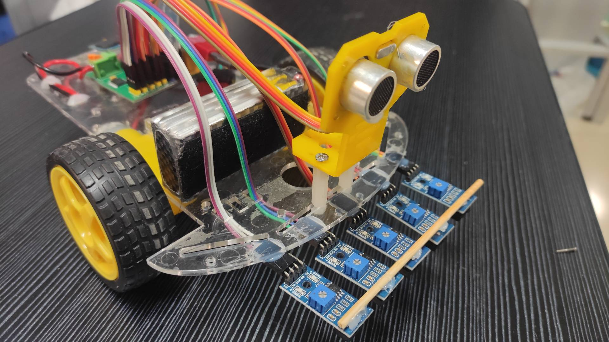
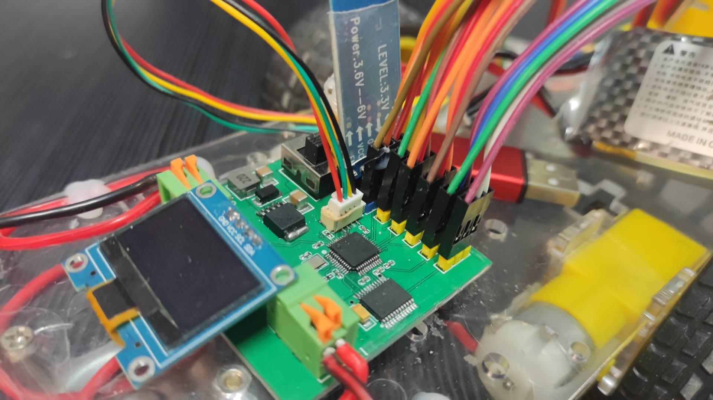
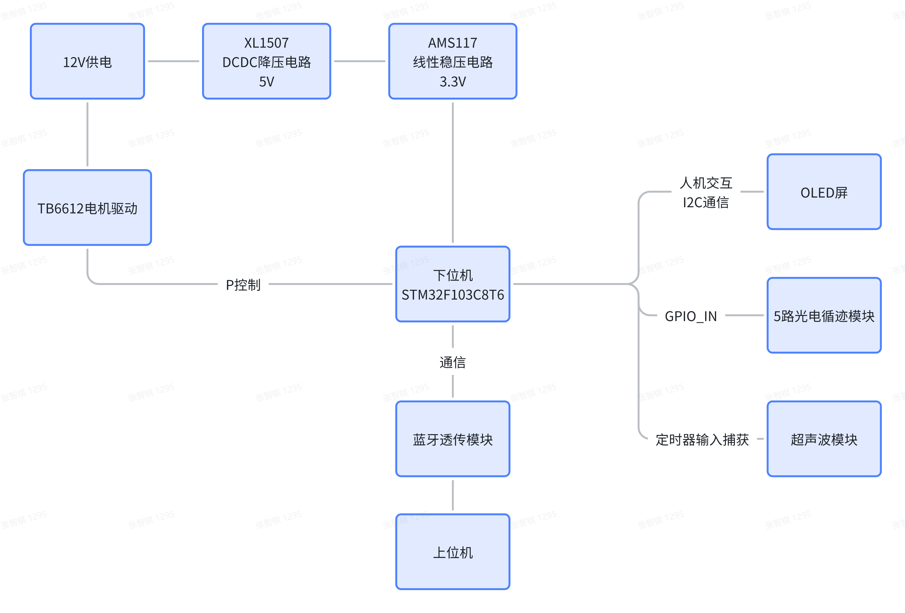
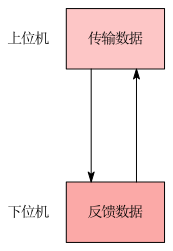
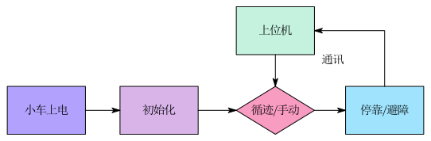
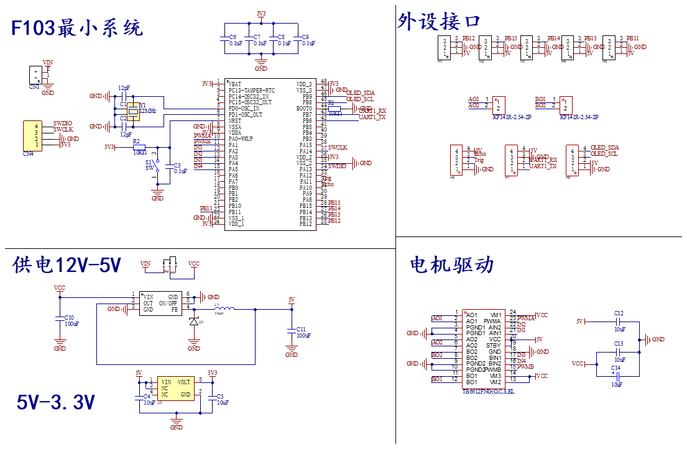
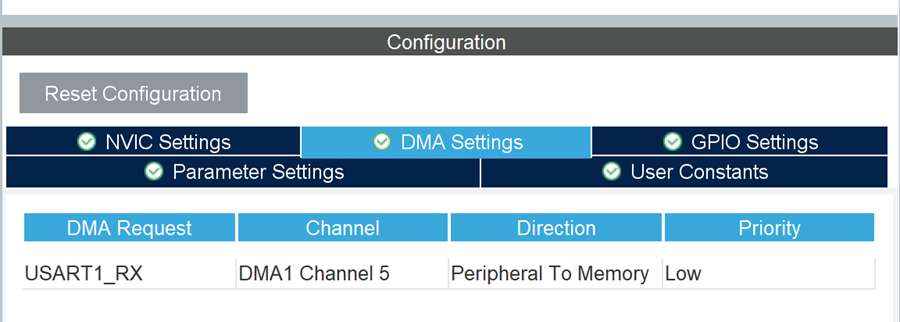
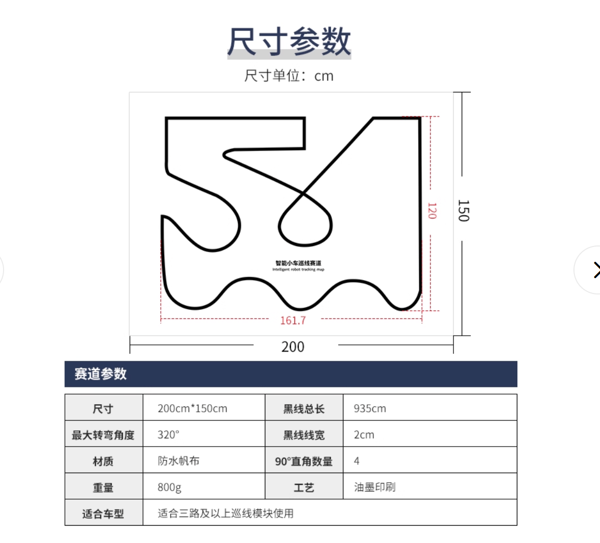

# STM32-Based Line-Tracking Mobile Robot

## Demo Video
<p align="center"> 
  <a href="assets/video/demo.mp4"> 
    
  </a> 
</p>

The animated preview above is provided by [`assets/video/demo.gif`](assets/video/demo.gif), and clicking it opens the original [`assets/video/demo.mp4`](assets/video/demo.mp4). GitHub repository READMEs do not reliably render a playable local `mp4` inline, so the GIF preview is the most stable option.

## Overview
This project is a line-tracking mobile robot built around the `STM32F103C8T6`. The repository includes the embedded firmware, the PC-side remote control interface, the hardware design figures, the original `.agx` drawing sources used to export SVG diagrams, the project specification PDF, and the component workbook.

From the firmware structure, the robot supports:

- automatic line tracking with five reflective sensors
- ultrasonic obstacle detection and avoidance
- station detection with timed stop-and-go behavior
- manual remote driving with differential steering
- UART telemetry upload to the PC host
- OLED status display for runtime feedback

## Key Functions
- `Tracking_Car/Core/Src/main.c`
  Runs the main loop, initializes peripherals, switches between auto mode and manual mode, sends telemetry, and refreshes the OLED UI.
- `Tracking_Car/User/tracker.c`
  Implements the line-following logic, station detection, obstacle handling, and differential motor correction.
- `Tracking_Car/User/remote.c`
  Handles `USART1 + DMA` command parsing, manual driving, parameter updates, and telemetry packets.
- `Tracking_Car/User/ui.c`
  Draws the robot state, direction, station count, distance, and warning messages on the OLED.
- `pc_remote.py`
  Provides the PC host interface for serial communication, telemetry display, and manual control.

## Hardware and Software

| Item | Detail |
| --- | --- |
| MCU | `STM32F103C8T6` |
| Firmware IDE | `Keil MDK-ARM V5.32` |
| Hardware Configuration | `STM32CubeMX` via `Tracking_Car/Tracking_Car.ioc` |
| System Clock | External `12 MHz` crystal, PLL to `72 MHz` |
| Motor PWM | `TIM2 CH1/CH2` |
| Motor Direction Pins | `PA2` to `PA5` |
| Ultrasonic Sensor | `TIM1` input capture, `PA11` Trig, `PA10` Echo |
| Line Sensors | `PB11` to `PB15` |
| OLED | `I2C1` on `PB8/PB9` |
| Telemetry / Remote | `USART1` with DMA receive-to-idle |
| PC Host Runtime | Python with `tkinter`, `pyserial`, and `pygame` |
| PC Host IDE | Running the script directly is enough; `Visual Studio 2026` can also be used if preferred |

## Figures

### Vehicle Photos
<p align="center">
  
  
</p>

### System Diagrams
<p align="center">
  
</p>

<p align="center">
  
</p>

<p align="center">
  
</p>

The corresponding drawing source files are kept in:

- `assets/figures/sources/overall_system_structure.agx`
- `assets/figures/sources/system_workflow_description.agx`

### Circuit, DMA, and Track Map
<p align="center">
  
</p>

<p align="center">
  
</p>

<p align="center">
  
</p>

## Repository Layout
```text
.
|- README.md
|- pc_remote.py
|- Tracking_Car/
|  |- Core/
|  |- Drivers/
|  |- MDK-ARM/
|  |- User/
|  `- Tracking_Car.ioc
`- assets/
   |- docs/
   |  |- Component.xlsx
   |  |- Component.svg
   |  `- Line_Tracking_Robot_Project_Specification.pdf
   |- figures/
   |  |- diagrams/
   |  |- photos/
   |  `- sources/
   `- video/
      |- demo.gif
      `- demo.mp4
```

## Component Workbook
The original component workbook is stored as [`assets/docs/Component.xlsx`](assets/docs/Component.xlsx).

GitHub README pages cannot embed a live `.xlsx` workbook directly, so the sheet below is displayed through the exported SVG preview you prepared from that workbook.


## Documents
- Project specification: [`assets/docs/Line_Tracking_Robot_Project_Specification.pdf`](assets/docs/Line_Tracking_Robot_Project_Specification.pdf)
- Component workbook: [`assets/docs/Component.xlsx`](assets/docs/Component.xlsx)
- Diagram source files: `assets/figures/sources/*.agx`

## Quick Start

### Firmware
1. Open `Tracking_Car/MDK-ARM/Tracking_Car.uvprojx` with `Keil MDK-ARM`.
2. Open `Tracking_Car/Tracking_Car.ioc` with `STM32CubeMX` if you want to inspect or regenerate peripheral settings.
3. Build and flash the firmware to the `STM32F103C8T6`.

### PC Host
1. Install Python dependencies: `pyserial` and `pygame`.
2. Run `pc_remote.py`.
3. Connect to the robot over the configured serial port for telemetry and manual control.
